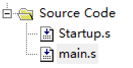
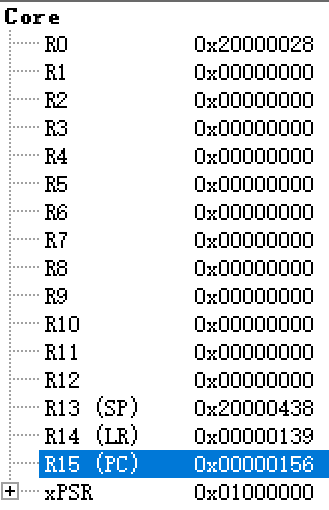
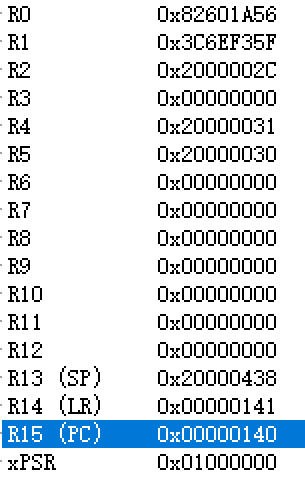
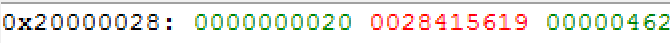
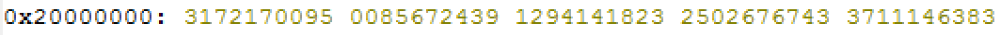

#LAB11_FunctionalDebugging

##一、Keil
    
本次实验我们使用软件Keil4进行对汇编代码的仿真调试。
    
安装下载链接：[点击下载](http://human-robot.sysu.edu.cn/course/Introduction%20to%20Cotex-M/MDK474.rar)
    
安装说明文档：[点击下载](http://human-robot.sysu.edu.cn/course/Introduction%20to%20Cotex-M/%E5%BC%80%E5%8F%91%E7%8E%AF%E5%A2%83%E5%8F%8A%E5%AE%89%E8%A3%85%E8%B0%83%E8%AF%95.docx)

##二、实验过程

* 解压打开工程
    
可以看见其中包含两个.s文件，Startup.s和main.s

Startup.s：完成基本的CPU初始化，如果有必要，这里也对外围的设备进行初始化

main.s：我们的主体程序， 执行完Startup.s后，跳转到Start

* 点击Debug->Start/Stop Debug Session，启动调试器
    
在调试状态，Debug菜单项中的命令可以使用了，有关编译的工具栏按钮消失了，出现了一个用于运行和调试的工具栏，Debug 菜单上的大部份命令都有相应的快捷按钮。

从左到右依次是复位、运行、暂停、单步跟踪、单步、执行完当前子程序、运行到当前行、下一状态、打开跟踪、观察跟踪、反汇编窗口、观察窗口、代码作用范围分析、1＃串行窗口、内存窗口、性能分析、工具按钮命令。

* 程序简介
    
main.s程序有两个缓冲区HappyBuf和SadBuf，程序将sad和happy两个8位变量赋为随机数，再将这两个变量转存到数组中。Cnt保存数组偏移量，Cnt被初始化为0，转存时先判断Cnt是否越界，若否，则将变量转存再将Cnt加1。

1. 首先点击step按钮，从startup.s进入main.s，此时会进入start，再点击则会进入init部分。其中，相当于将cnt赋为0。

如图为初始化后的寄存器状态
2. 跳入loop部分。将sad和happy的地址赋给r4，r5。然后进入random部分，取得一个形式为1664525*M+1013904223的随机数，即返回0到2^32-1的随机数。

3. 回到loop将随机数赋给sad，happy同理也赋一个随机数。

4. 跳到save部分，判断cnt是否到达size的值，即20,。然后将sad和happy分别存进sadbuff和happybuff里，将cnt+1。

如此循环，直到cnt到达20

如图为运行后的寄存器状态，与何时停止有关
##三、运行结果

1、cnt

如图可见cnt已到达20

2、happybuff

如图，happybuff是记录happy所有值的数组

##四、总结
    
本次实验使用了Keil软件进行汇编程序的debug过程，在过程中可以更清楚的了解程序的运行过程，更清晰的了解每一句的功能，方便分析代码以及检查错误。也回顾了汇编程序的很多细节，收获很多。

    
    
    
