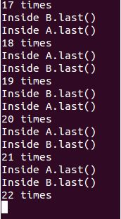

# Deadlock

## 一、实验截图

## 二、产生死锁的4个必要条件

### （1）互斥：

​	一个资源每次只能被一个进程使用。

### （2）请求与保持：

​	一个进程因请求资源而阻塞时，对已获得的资源保持不放。

### （3）不剥夺：

​	进程已获得的资源，在为使用完之前，不能强行剥夺。

### （4）循环等待：

​	若干进程之间形成一种头尾相接的循环等待资源关系。

## 三、程序产生死锁的解释

​	程序在主函数的小狗函数建立Thread线程，使之在start函数调用后自动调用了run函数而启动b的method函数。而a和b的method函数又是互相调用对方的last函数而输出字符串到console，所以一直有线程抢占主线程的资源来运行。二主线程只有在子线程刚结束时，加入运行，调整count使得while语句运行后，调用a的method函数，此时如果a正好被占用而被主线程获得的话，就成生了死锁。

​	所以出现死锁也是随机事件，尤其是cpu运行较快时，在线程进行上下文转换时，while就运行完成时，就很难产生死锁了。
